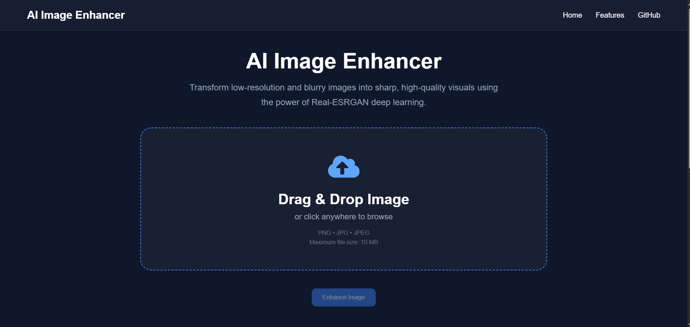
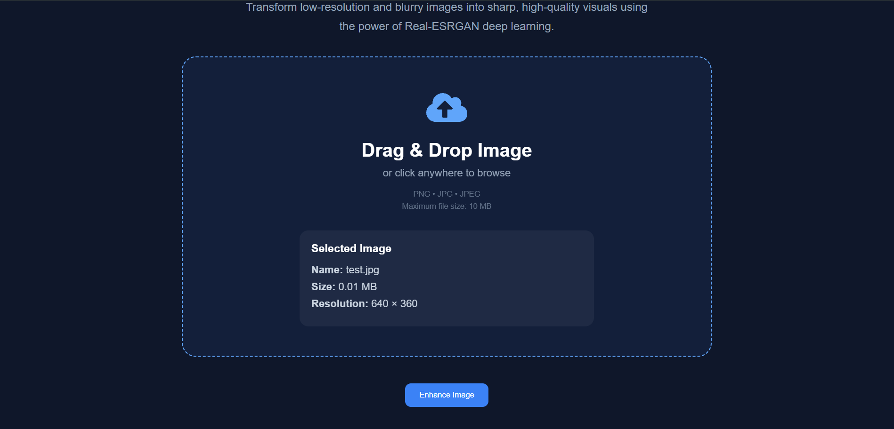
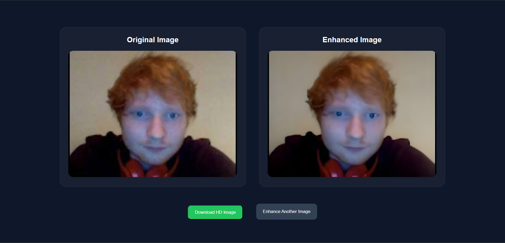

# AI Image Enhancer

An AI-powered image enhancement web application built with **React**, **Django REST Framework**, and **Real-ESRGAN**. The application restores blurry and low-resolution images into high-quality versions using deep learning.

---

## Preview

### Home Page



### Upload Image



### Enhancement Result




---

## Features

- AI-powered image enhancement using Real-ESRGAN
- Drag & Drop image upload
- Image preview before enhancement
- Image information (name, size, resolution)
- Side-by-side image comparison
- Download enhanced HD image
- Responsive modern UI
- Django REST API backend
- React frontend

---

## Tech Stack

### Frontend
- React.js
- Axios
- CSS3
- React Icons

### Backend
- Django
- Django REST Framework
- Python

### AI / Image Processing
- Real-ESRGAN
- PyTorch
- OpenCV

---

## Project Structure

```
AI-Image-Enhancer
│
├── ai_models/
│
├── backend/
│   ├── ai/
│   ├── config/
│   ├── enhancer/
│   ├── media/
│   ├── manage.py
│   └── requirements.txt
│
├── frontend/
│   ├── public/
│   ├── src/
│   ├── package.json
│   └── ...
│
├── docs/
│   ├── home.png
│   ├── upload.png
│   ├── result.png
│   
│
├── .gitignore
├── LICENSE
└── README.md
```

---

## How It Works

```
User Uploads Image
        │
        ▼
React Frontend
        │
        ▼
Django REST API
        │
        ▼
Real-ESRGAN Model
        │
        ▼
Enhanced Image Generated
        │
        ▼
Returned to Frontend
```

---

## Installation

### Clone Repository

```bash
git clone https://github.com/AbinSanilkumar/AI-Image-Enhancer.git

cd AI-Image-Enhancer
```

---

### Backend Setup

```bash
cd backend

python -m venv venv

venv\Scripts\activate

pip install -r requirements.txt
```

Run migrations

```bash
python manage.py migrate
```

Start the server

```bash
python manage.py runserver
```

---

### Frontend Setup

```bash
cd frontend

npm install

npm run dev
```

---

## API Endpoint

### Upload Image

```
POST /api/upload/
```

**Form Data**

```
image : File
```

**Sample Response**

```json
{
  "message": "Image enhanced successfully",
  "data": {
    "original_image": "...",
    "enhanced_image": "..."
  }
}
```

---

## Future Improvements

- User authentication
- Enhancement history
- Batch image enhancement
- Multiple AI models
- Image comparison slider
- Docker support
- GPU deployment

---

## License

This project is licensed under the MIT License.

---

## Author

**Abin Sanil Kumar**

GitHub: https://github.com/AbinSanilkumar

LinkedIn: *(Add your LinkedIn profile here)*

---

## Acknowledgements

- Real-ESRGAN
- Django
- React
- PyTorch
- OpenCV
